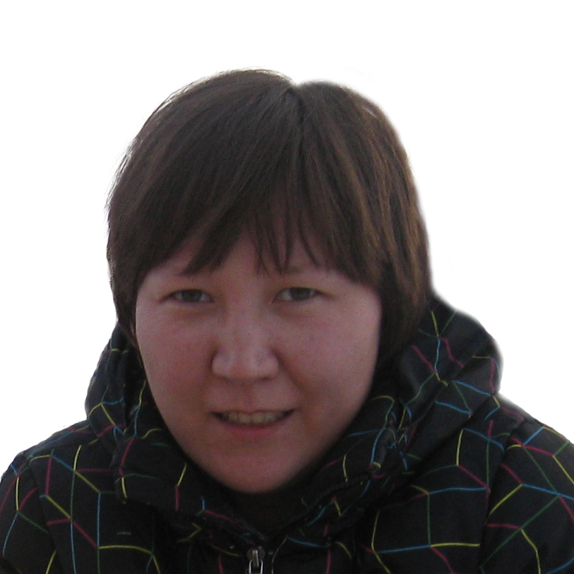

# Lazzat Mukhametalinova

> ## contact

* _location_: **Almaty, Kazakhstan**
* _telegram_: **[@lm2248](https://t.me/lm2248)**
* _discord_: **[Lazzat#1328](https://discordapp.com/users/770363218496454666/)**

> ## info

I entered to the RS School because I like codinging.  
In my school time I got carried away by the Basic language.  
So I decided to try my hand at this field again.

> ## computer skills

* **HTML**
* **CSS**
* **JavaScript**
* **Git**
* Adobe Illustrator
* Adobe Photoshop
* Adobe inDesign
* AutoCAD
* AVEVA PDMS

> ## code example

```
function squares(x, n) {
  let arr = [];
  for (let i = 0; i < n; i++) {
    arr.push(x);
    x = Math.pow(x,2)
  }
  return arr;
}
```

> ## languages

* Russian (C1)
* Kazakh (B2)
* **English (B1)**

> ## education

2001-2006  
**Satbayev University (Almaty)**  
Institute of Oil and Gas

> ## experience

* [Markdown & Git](https://2248lm.github.io/rsschool-cv/cv)
* [HTML, CSS & Git Basics](https://2248lm.github.io/rsschool-cv/)
* [Audio Player](https://2248lm.github.io/audio-player/)
* [Virtual Piano](https://2248lm.github.io/virtual-piano/)
* [Portfolio](https://2248lm.github.io/portfolio/)
* [Online ZOO](https://2248lm.github.io/online-zoo/pages)
* [Wildlife](https://2248lm.github.io/wildlife/)

> ## additional

* **Software Development Methodologies** (EPAM, online)
* **Introduction to Testing** (EPAM, online)
* **Version Control with Git** (EPAM, online)
